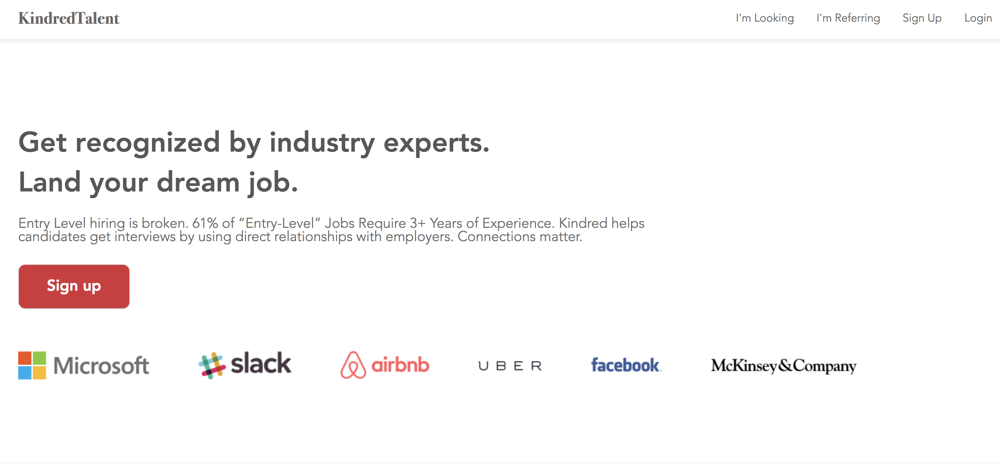
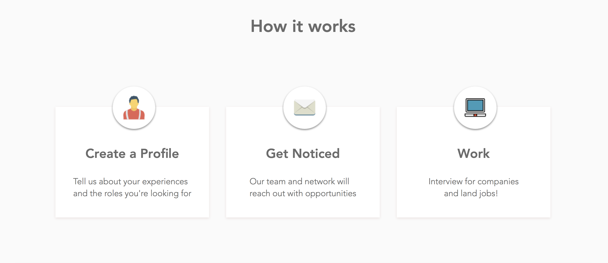
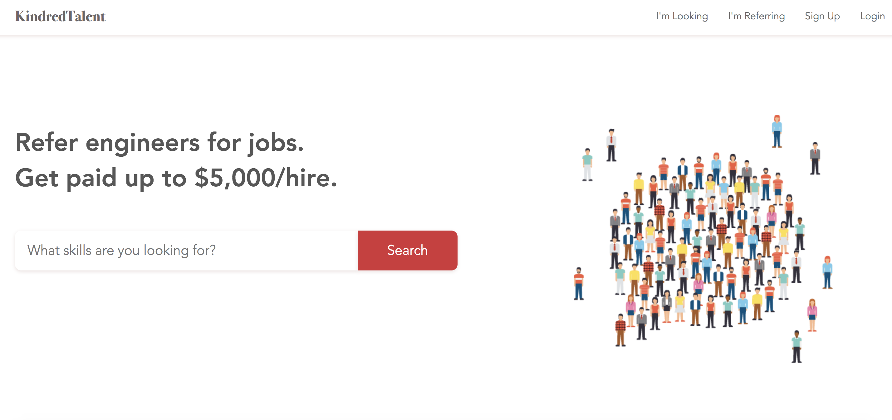
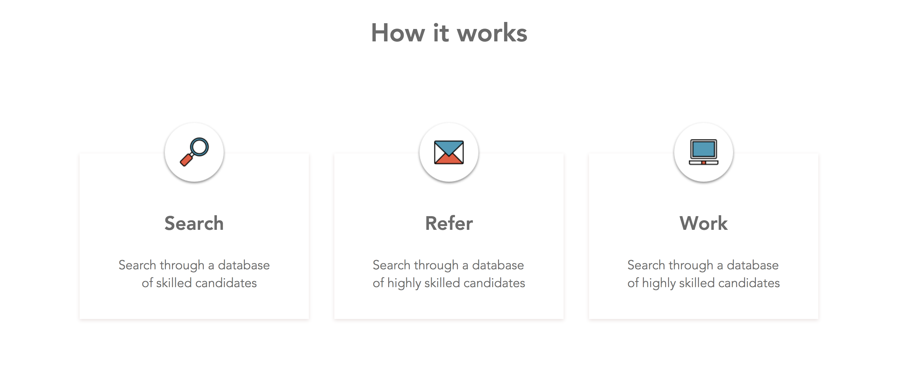

## Overview

www.kindredtalent.com

## Running

Install dependencies: `$ npm install` or `$ yarn`

Fire up a development server: `$ npm run dev`

Once the server is running, you can visit `http://localhost:3000/`

## File layout

- **Frontend React**
    <!-- - The top level application Container is in `frontend/containers/AppContainer.js` -->
    - CSS styles are in `frontend/assets/stylesheets/base.scss`
- **Backend Express**
    - Entry point is `server.js`
    - API routes are under `backend/routes.js`
    - API routes are served under `http://localhost:3000/api`

